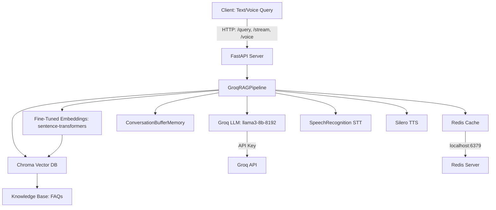

```mermaid
graph TD
    A[Client: Text/Voice Query] -->|HTTP: /query, /stream, /voice| B[FastAPI Server]
    B --> C[GroqRAGPipeline]
    C --> D[Groq LLM: llama3-8b-8192]
    C --> E[Chroma Vector DB]
    C --> F[Redis Cache]
    C --> G[ConversationBufferMemory]
    C --> H[Fine-Tuned Embeddings: sentence-transformers]
    C --> I[SpeechRecognition STT]
    C --> J[Silero TTS]
    E --> K[Knowledge Base: FAQs]
    H --> E
    D -->|API Key| L[Groq API]
    F -->|localhost:6379| M[Redis Server]
```